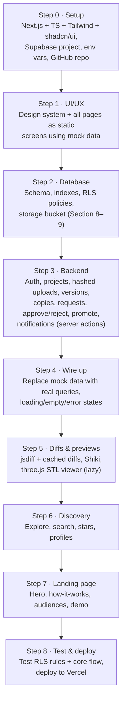

# PRD — [Project Name]: Version Control for Everyone

## 1. Chat summary (decisions so far)

- **Idea:** a GitHub-like platform with the same open-source visibility, but no Git install and no Git vocabulary (push, fork, commit). Everything is done through buttons, dropdowns, and drag-and-drop.
- **Audience:** poets/writers, coders, CAD artists, and "normal" users. It's one account type for everyone; roles are profile tags, and anyone can contribute to any field. New fields can be added later as new project types.
- **Budget:** free tiers only. This starts as a personal project, and we scale it if it proves potential.
- **Core rule (from the owner's sketch):** the owner's main work is **locked**. Others never edit it. They make a modified copy, ask permission to publish it in their own space, and the owner can later promote a copy to become the new main.
- **Rejected idea:** a "trusted collaborator" role with direct edit access to main. It was dropped because it conflicts with the locked-main rule.
- **Versioning engine:** a custom Git-style model (content-addressed files, versions with parent pointers), not real Git, so it runs on serverless free tiers. Its structure allows a Git export later.
- **Known limit:** Supabase free storage (~1 GB) will be the first scaling wall, mainly because of CAD files.

### Open decision
- [ ] Can contributors create a private draft copy **without** asking? (Assumed **yes**; permission is required only to publish.)

---

## 2. Problem
Git and GitHub require installing Git, learning commands, and understanding repos, branches, and pull requests. This blocks non-developers such as writers and CAD designers, and beginners, from versioned, open collaboration.

## 3. Goals
1. Zero install, zero commands: everything works in the browser with buttons.
2. Open and discoverable work, like GitHub.
3. Safe collaboration: the original is never altered without the owner's consent.
4. Credit is always preserved.

**Non-goals (v1):** real Git hosting, CI/CD, merging CAD files, mobile apps.

## 4. Plain-language vocabulary

| Git | This app |
|---|---|
| repo | Project |
| commit | Save version |
| fork | Make my copy |
| pull request | Request to publish |
| merge to main | Make this the main version |

## 5. Core flow

1. The **owner** publishes a project (writing, code, or CAD). Its main version is locked.
2. A **contributor** clicks "Make my copy", which creates a private draft built on the current main.
3. The contributor edits the draft (paste text, upload files, drag-and-drop) and saves versions.
4. The contributor clicks **Request to publish** and adds a note.
5. The **owner reviews** the request and picks one of three actions:
   - **Approve:** the copy becomes public in the contributor's space, credited as "based on X by owner".
   - **Ask for changes:** the owner comments, the contributor resubmits, and the same request continues.
   - **Reject:** an optional reason is sent, and the draft stays private to the contributor.
6. **Promote (optional):** the owner opens the "Versions by others" tab and clicks **Make this the main version** on any published copy. The old main stays in history, and the contributor is credited.
7. If a copy was built on an older main, the owner sees a warning before promoting.

## 6. Features by priority

**P0 (MVP)**
- Sign up and login (email plus Google or GitHub)
- Create a project with a title, description, type, and public or private visibility
- Upload files by drag-and-drop or paste text into an editor; save a version with a note
- Version history, and restore an old version (owner only)
- Make my copy, private drafts, request to publish
- Requests inbox, review screen, approve / ask for changes / reject
- Promote a copy to main, with credit and main history
- In-app notifications

**P1**
- Side-by-side differences: word-level for writing, line-level for code
- Syntax-highlighted code view
- 3D STL viewer, with side-by-side synced rotation for CAD review
- Explore page, search, and stars
- Public profile showing own projects and published copies

**P2**
- STEP file support, Git export, comments on specific lines

## 7. Tech stack

**Languages:** TypeScript (whole app) and SQL (Postgres schema and security rules)

**Frontend**
- Next.js (App Router) with React
- Tailwind CSS and shadcn/ui
- jsdiff for comparing versions
- Shiki for code highlighting
- three.js for the STL viewer

**Backend**
- Next.js server actions and API routes, hosted on Vercel
- Supabase Postgres, Auth, Storage, Row Level Security, and Realtime

**Hosting and tools:** Vercel and Supabase free tiers, GitHub for the repo, VS Code with Claude Code

## 8. Data model

```
profiles        id (pk, = auth.users.id), username (unique), display_name, tags text[], created_at
projects        id, owner_id → profiles, title, description,
                type enum(writing|code|cad), visibility enum(public|private),
                main_version_id → versions, created_at
versions        id, project_id → projects, parent_id → versions (nullable),
                author_id → profiles, note,
                status enum(draft|pending|changes_requested|published|rejected),
                created_at
blobs           hash (pk, sha256 hex), size, mime, storage_path
version_files   version_id → versions, path, hash → blobs   PK(version_id, path)
review_requests id, version_id (unique) → versions, owner_id, contributor_id,
                status enum(pending|changes_requested|approved|rejected),
                owner_comment, diff_cache jsonb, created_at, resolved_at
main_history    project_id, version_id, promoted_by, promoted_at
notifications   id, user_id, type, ref_id, read bool, created_at
stars (P1)      user_id, project_id   PK(user_id, project_id)
```

**Indexes:**
- `review_requests(owner_id, status)` for the inbox
- `notifications(user_id, read)`
- `versions(project_id, status)`
- `versions(parent_id)`
- `projects(owner_id)`

## 9. Security rules (Row Level Security)

- Only the project owner can update `projects`, including `main_version_id`. This is what keeps main locked at the database level.
- Any logged-in user can insert a `versions` row whose author is themselves, on a public project.
- Draft versions are visible only to their author. Published versions are visible to everyone, as long as the project is public.
- `version_files` can only change while the version's status is `draft`. After that, versions are immutable.
- Only the owner can update `review_requests`. The contributor can only create requests and resubmit them.
- Notifications are readable and updatable only by their `user_id`.

## 10. Efficiency requirements

- **File storage:** each file is stored once, keyed by its SHA-256 hash. Before uploading, check whether the hash already exists, and skip the upload if so. This check is O(1).
- **Versions:** each version stores a full manifest of `(path, hash)` rows. These rows are tiny, file contents are never duplicated, and loading any version takes one query with no walking back through the chain.
- **Differences:** compute them **once** when a request is submitted and store them in `diff_cache`. Never recompute them when the review screen opens. Writing projects use `diffWords`, code uses `diffLines`, and CAD has no diff.
- **Approve and promote:** a single status or pointer update inside a transaction, with no file copying.
- **Lists:** use paginated queries backed by the indexes above. No N+1 queries.
- **Dependencies:** keep them minimal, and load three.js lazily, only on CAD pages.

## 11. Pages

- Landing
- Auth
- Dashboard (my projects, my copies)
- Project page with tabs: Files, History, Versions by others
- Editor / upload
- Requests inbox
- Review screen
- Explore (P1)
- Profile (P1)
- Notifications dropdown

## 12. Build plan for Claude Code

Build one phase at a time. At the end of each phase: stop, summarize what was built, and wait for approval.



**Phase 2 is done when:** a second user cannot update a project they don't own, even when calling Supabase directly.

**Phase 3 is done when:** the full flow in Section 5 works end-to-end, tested with two accounts.
